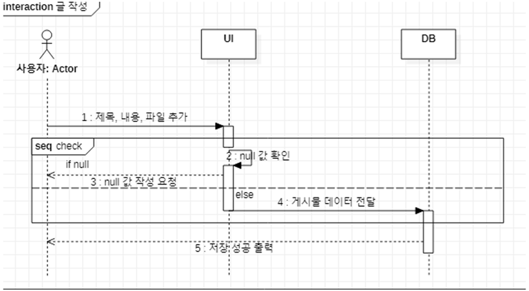
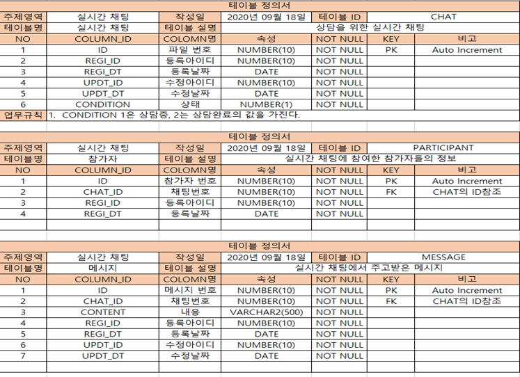
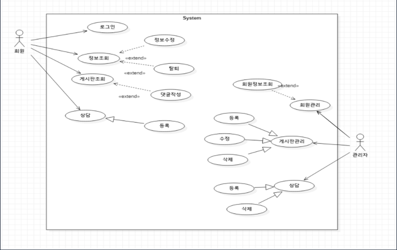
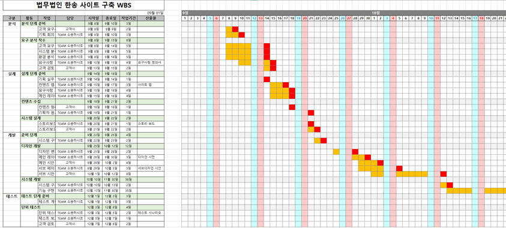

# Lawfirm SongHan 
-----

# 개요
* 프로젝트 명 : Lawfirm SongHan 사이트 구축

* 일정 : 20.9.24. ~ 20.12.10. / 유지보수 : 20.12.10 ~

* 팀 구성 : 한정원, 송민준

* 목적 : 법무법인 송한의 사이트 구축
         법률 정보 및 상담이 필요한 고객에게 서비스를 제공한다.
           
* 사용 기술 및 개발환경
   - O/S : Windows 10(개발환경), Linux ubuntu 18.04(운영환경)
   - Server : Apache2, Tomcat8.5
   - DB : Orarcle 11g(RDS)
   - Framework/flatform/Library : Spring, Security, Swagger, Bootstrap, JQuery, Mybatis, Websocket, Jsoup
   - Language : JAVA, HTML, JavaScript
   - Tool : Intellij, STS, Github, AQuerytool, StarUML, SQL Developer, Photoshop CS6
   - API : Google Developer, Kakao Developer, recaptcha, summernote
   
# 내용
* [PPT(Slideshare)](https://www2.slideshare.net/ssuser0b539c/lawfirmsonghan)

* 구현 기능
   - 로그인(SSO)
   - 회원가입
   - 게시판(상담, 공지사항, 언론보도, 자료실, summernote, 댓글)
   - 검색(키워드)
   - 보안(SSL, XSS 방어, recaptcha, 비밀번호 해싱)
   - 메인화면(사이트 소개, 분야 소개)
   - 실시간 상담(자체 채팅 기능, 카카오 채팅기능)
* 팀원별 역할
   - 한정원 : 메인화면, DB설계, 호스팅(AWS), 보안, 로그인, 회원가입, 게시판
   - 송민준 : 검색, 실시간 상담
   - 공통 : 기획
   
* 설계의 주안점
   - 법무법인 및 법률에 대한 정보들을 제공하고 통합 관리가 쉽게 한다. 
      
* 산출물(대표)
   - ERD
     
   - 시퀀스 다이어그램
     
   - 테이블 정의서
     
   - 유스케이스 다이어그램
     
   - WBS
     
   - 클래스 다이어그램
     
   - 회의록
     
